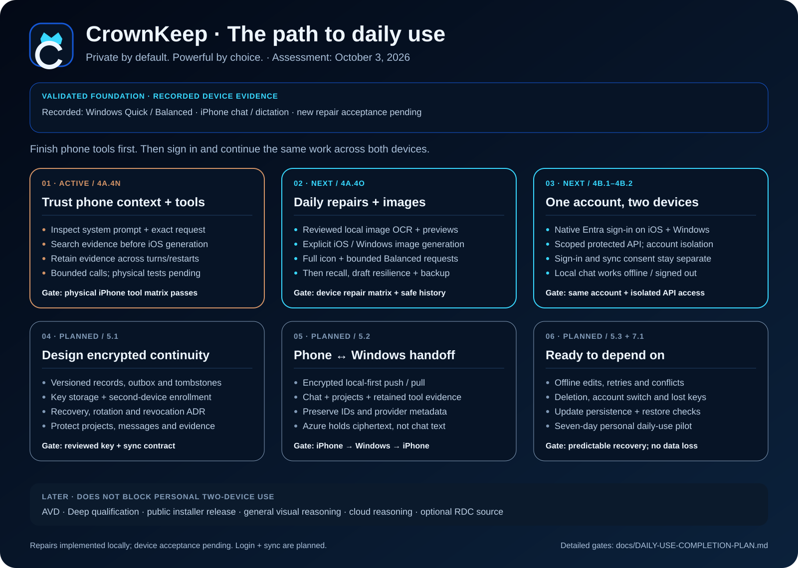

# CrownKeep

> **Private by default. Powerful by choice.**

**CrownKeep** is a local-first conversational AI application for Windows and iPhone. The assistant inside CrownKeep is **Anne**.

The product is designed around one durable conversation experience that can use device-local AI whenever practical and later move explicitly to RDC-hosted cloud AI without binding a conversation to a single model.

## Roadmap



The visual above is shared with the CrownKeep app. Detailed sprint definitions and exit criteria live in [docs/ROADMAP.md](docs/ROADMAP.md).

## Current status

**Phase 4A — Local Platform Convergence / Sprint 4A.4 acceptance is active.**

Current baseline:

- shared provider-neutral CrownKeep conversation experience on Windows and iPhone;
- Windows System Foundry authority with Quick/Balanced/Deep role policy and observed benchmark evidence;
- physical Windows Quick, Balanced Mistral Nemo, exclusive model switching, and local dictation validated;
- native iPhone Apple Foundation Models + on-device speech build installed on Rolo15, with current-build acceptance revalidation still open;
- AVD acceptance still pending under the same adaptive Windows policy;
- registered local `/search` and read-only network `/url` tool proofs;
- no silent cloud-model fallback and no live RDC customer-data connection.

Next local product steps are stable installer/storage behavior followed by provider-neutral automatic tools and multimodal/image capabilities. Image generation remains a future explicit tool boundary rather than an implicit cloud capability.

## Privacy boundary

The repository is intentionally public, but real user/customer data is not.

Current local conversations are stored in the browser's local IndexedDB database on that device. No Azure synchronization, Entra sign-in, cloud AI, or RDC customer-data integration is connected yet.

## Durable project context

Start here before making changes:

- [Project Context](docs/PROJECT-CONTEXT.md)
- [Architecture](docs/ARCHITECTURE.md)
- [Sprint Roadmap](docs/ROADMAP.md)
- [Decision Log](docs/DECISIONS.md)
- [Security Model](docs/SECURITY.md)
- [Current Status](docs/STATUS.md)
- [Testing Guide](docs/TESTING.md)
- [Brand System](docs/BRAND.md)
- [Foundry Local Device Snapshot](docs/FOUNDRY-LOCAL-DEVICE.md)
- [Naming Notes](docs/NAMING.md)
- [Agent Instructions](AGENTS.md)

Chat conversations are not the system of record. Decisions, completed work, blockers, and architectural changes must be reflected in this repository.

## Local development

Prerequisite: Node.js 22 and Git.

```powershell
git clone https://github.com/dakROLO/rdc-ai.git
Set-Location .\rdc-ai
npm install
npm run dev
```

If the repository is already cloned:

```powershell
Set-Location .\rdc-ai
git pull
npm install
npm run dev
```

For same-network phone testing:

```powershell
npm run dev -- --host
```

Use the Network URL printed by Vite rather than `localhost`.

Validation:

```powershell
npm run lint
npm run build
```

See [Testing Guide](docs/TESTING.md) for the current sprint acceptance procedure, including the **Fresh Windows machine** setup path.

### Foundry Local development

The first real Windows-local integration expects Foundry Local on a stable loopback port:

```powershell
foundry server restart --port 39839 --idle-timeout 0
foundry model download phi-4-mini
foundry model load phi-4-mini
foundry server status
```

Then run CrownKeep and choose **Anne · Foundry Local**.

## Core architectural rule

A conversation does not belong to a model.

Provider/model metadata belongs to individual assistant messages so the same conversation can later contain responses from Anne via Foundry Local, an iPhone-local model, CrownKeep cloud AI, and local AI again.

## Scope boundary

The application contains a future `ContextProvider` interface but does not connect to RDC customer, Blueprint, dashboard, document, or operational data.

## License

A public-source license has not yet been selected. Until one is chosen, normal copyright applies.


## End a local development session

If you are finished with local AI for the day, the simplest cleanup is:

```powershell
foundry server stop
```

That stops the Foundry Local daemon and local inference service.

If you want to keep the daemon running but free the loaded model from memory:

```powershell
foundry model unload phi-4-mini
```

Downloaded model files remain in the Foundry cache, so unloading or stopping the server does not require re-downloading the model next time.
