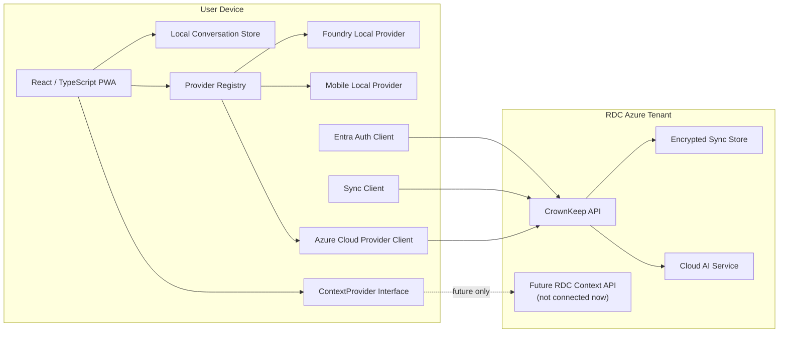

# CrownKeep — Architecture

## System view



## Responsibility boundaries

### Client/device

Owns:

- local conversation persistence;
- local provider execution;
- provider selection;
- local/cloud message metadata;
- sync encryption/decryption;
- cloud escalation confirmation;
- offline usability.

Must not contain:

- cloud AI service credentials;
- database credentials;
- Azure service account secrets;
- RDC customer data committed as fixtures.

### RDC Azure

Owns:

- Entra-protected API boundary;
- encrypted sync transport/storage;
- cloud AI credential handling;
- server-side managed identities;
- future protected context API.

Azure synchronization should not require plaintext conversation content.

### Future RDC data systems

Out of current implementation scope.

The client may know only an abstract `ContextProvider` contract. There is no direct database connection from the client and no production RDC context integration.

## Core interfaces

### AIProvider

Approximate responsibilities:

```ts
export interface AIProvider {
  readonly id: string;
  readonly displayName: string;
  readonly location: "local" | "cloud";

  getAvailability(): Promise<ProviderAvailability>;
  listModels(): Promise<AIModel[]>;
  streamChat(request: ChatRequest, signal?: AbortSignal): AsyncIterable<ChatChunk>;
}
```

Provider-specific SDK/runtime details stay inside adapters.

### ConversationRepository

```ts
export interface ConversationRepository {
  create(input: CreateConversationInput): Promise<Conversation>;
  get(id: string): Promise<Conversation | undefined>;
  list(): Promise<Conversation[]>;
  saveMessage(message: Message): Promise<void>;
  listMessages(conversationId: string): Promise<Message[]>;
}
```

Initial browser/PWA implementation will use IndexedDB behind this interface.

### SyncProvider

```ts
export interface SyncProvider {
  getStatus(): Promise<SyncStatus>;
  push(changes: EncryptedSyncChange[]): Promise<SyncReceipt>;
  pull(cursor?: string): Promise<SyncBatch>;
}
```

The sync service transports encrypted envelopes rather than requiring plaintext message content.

### ContextProvider

```ts
export interface ContextProvider {
  readonly id: string;
  isAvailable(): Promise<boolean>;
  getContext(request: ContextRequest): Promise<ContextPacket>;
}
```

Only synthetic/mock implementations are allowed until real RDC context integration is explicitly scheduled.

## Conversation/provider rule

Provider/model metadata belongs to each assistant message.

```text
Conversation A
 ├─ user message
 ├─ assistant — Foundry Local / model X
 ├─ user message
 ├─ assistant — CrownKeep Cloud / model Y
 ├─ user message
 └─ assistant — mobile local / model Z
```

This preserves conversation continuity while allowing provider changes.

## Local database direction

Use a repository abstraction over IndexedDB for the PWA.

Goals:

- offline reads/writes;
- immutable IDs;
- explicit schema migrations;
- local sync metadata;
- no dependence on React component lifecycle.

## Azure API direction

The client authenticates through Entra as a public client and calls an Entra-protected CrownKeep API.

The API, not the client, accesses Azure cloud services requiring credentials.

Prefer managed identity for Azure-to-Azure access and Key Vault only where a secret is genuinely required.

## Encryption direction

The exact key-management mechanism is intentionally not selected in Phase 0.

Before implementing sync encryption, create an ADR covering:

- user/device key hierarchy;
- second-device enrollment;
- key storage on Windows/iPhone;
- key rotation;
- device revocation;
- recovery behavior;
- what metadata remains visible to Azure.

Use established platform cryptography and authenticated-encryption modes.

## Deployment direction

Initial application:

- shared web/PWA artifact;
- local providers run on-device;
- cloud API deployed separately in RDC Azure;
- environment-specific public configuration injected at build/runtime;
- no production secrets in the repository.

## Architecture invariants

1. Local chat does not require Azure.
2. Conversation identity is independent of inference provider.
3. Cloud credentials do not enter the browser/PWA.
4. Sync storage does not need plaintext conversations.
5. Real RDC data remains disconnected until explicitly scheduled.
6. Public repository contents must be safe for anonymous viewing.


## Windows desktop distribution direction

CrownKeep's target Windows release is a normal downloadable desktop installer, not a developer workflow that requires PowerShell or a separately installed Foundry Local CLI.

Current direction:

- retain the React/TypeScript UI and provider-neutral conversation architecture;
- add a native Windows desktop shell when packaging work begins;
- embed the current Foundry Local SDK in the desktop application so normal users do not need to install or operate the Foundry CLI;
- use the SDK for hardware detection, execution-provider selection, model discovery/acquisition, loading, inference, and cache management;
- download the chosen model during first-run setup rather than bundling multi-hundred-MB/GB model files into the installer;
- benchmark observed performance during onboarding and persist a known-good model/variant choice;
- keep advanced model/runtime controls available for troubleshooting without requiring them for normal use;
- produce a signed Windows setup executable for direct web download, with MSI/MSIX/Store distribution considered later if useful.

A Tauri 2 desktop shell with the Foundry Local Rust SDK is a strong implementation candidate because it can preserve the current React UI while providing native process/runtime access and Windows installer packaging. This is an implementation direction to validate during the packaging sprint rather than a locked framework dependency.

The existing PWA remains useful for browser/mobile work and as a development surface, but the Windows downloadable product may use a native shell because local runtime/model management is a concrete capability gap that a browser-only PWA cannot reliably own.


## Local runtime lifecycle contract

CrownKeep separates **inference** from **runtime lifecycle management**.

`AIProvider` remains responsible for provider availability, model listing, and chat inference.

`LocalRuntimeManager` is responsible for native lifecycle capabilities such as:

- inspect local runtime state;
- start/stop the runtime;
- install/acquire a model;
- load/unload a model;
- report which lifecycle actions the current host can perform.

The current browser development host uses `BrowserLocalRuntimeManager`. It can inspect Foundry Local and guide setup, but it intentionally cannot start/stop the daemon or install/load/unload models from browser JavaScript.

The future Windows desktop host will implement the same runtime contract with embedded/native capabilities. This lets the existing React onboarding UI survive the transition from the engineering CLI workflow to a normal Windows installer.

First-run state is derived from three stages:

1. runtime reachable;
2. model selected/available;
3. local inference verified through an observed quick check.

Successful verification is stored locally with the selected provider/model and basic observed timing. The stored record is advisory and can be invalidated by changing the model/runtime.

Runtime performance guidance is based on observed first-token and total-response timing, not solely on a CPU/GPU/NPU label.


## iPhone native local-AI direction

The primary iPhone local-inference path is a native Apple host using the Foundation Models framework rather than treating browser WebGPU/WebLLM as the default.

Architecture:

```text
CrownKeep React UI
        |
        v
AppleFoundationModelsProvider
        |
        v
NativeAIHost TypeScript bridge
        |
        v
iPhone native host
        |
        v
Foundation Models framework
        |
        v
SystemLanguageModel.default
```

The React conversation system remains provider-neutral. The native host supplies local inference capability but does not own conversation identity.

### Native/provider boundary

- `src/native/NativeAIHost.ts` defines the JavaScript-side native bridge.
- `src/providers/AppleFoundationModelsProvider.ts` adapts that bridge to `AIProvider`.
- `native/ios/CrownKeepFoundationModelsService.swift` is the initial Swift service boundary.
- The bridge must surface model availability explicitly and must not silently route unavailable local requests to cloud.
- Safari/PWA mode remains useful for the CrownKeep UI and local conversation storage, but it cannot claim access to Apple's Foundation Models framework unless the native host is present.

### Apple availability

CrownKeep must distinguish at least:

- model available;
- device not eligible;
- Apple Intelligence not enabled;
- model not ready;
- unknown/unhandled availability.

### Model/session strategy

For the first device vertical slice, the native host may return a complete non-streaming response as one `ChatChunk` to prove the bridge.

After the bridge works, Sprint 3.2 will add native streaming, cancellation, token/context instrumentation, and mobile resource handling.

WebLLM/WebGPU remains an optional fallback/experimental provider rather than the primary iPhone implementation.


## Phase 4A Windows product host

CrownKeep's Windows productization path preserves the existing React conversation application and adds a native desktop host only for capabilities the browser cannot own reliably.

Target shape:

```text
CrownKeep React UI
        |
        +---- AIProvider ----------------------> conversation inference
        |
        +---- LocalRuntimeManager
                     |
                     +-- browser development -> BrowserLocalRuntimeManager
                     |
                     +-- Windows desktop -----> TauriLocalRuntimeManager
                                                    |
                                                    v
                                               Tauri/Rust host
                                                    |
                                      Phase 4A.2: Foundry Local Rust SDK
                                                    |
                                               Windows WinML
```

Sprint 4A.1 exposes only a native host identity command. It intentionally does not start/stop Foundry Local or install/load/unload models yet.

The first native command is:

```text
crownkeep_host_info
```

The TypeScript runtime selector chooses `TauriLocalRuntimeManager` only when the frontend is actually running inside Tauri. Ordinary browser/PWA development continues to use `BrowserLocalRuntimeManager`.

### Windows host invariants

1. The React conversation/domain/provider layer remains shared.
2. The native host owns OS/runtime lifecycle capabilities, not conversation identity.
3. Browser mode remains usable for engineering and regression testing.
4. Native runtime actions are surfaced through `LocalRuntimeManager`, not direct UI shell commands.
5. Foundry Local SDK integration must not require Azure or cloud credentials.
6. The installed product must eventually use a stable local storage location/origin and explicitly handle migration/export from browser-development storage.
