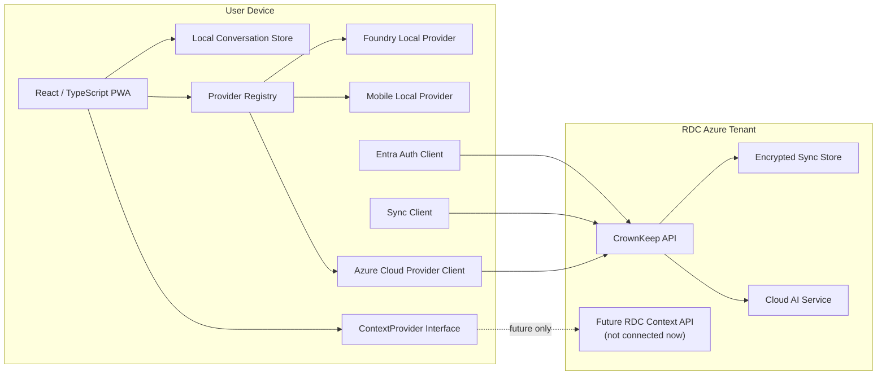

# CrownKeep — Architecture

## System view



## Responsibility boundaries

### Client/device

Owns:

- local conversation persistence;
- local provider execution;
- provider selection;
- local/cloud message metadata;
- sync encryption/decryption;
- cloud escalation confirmation;
- offline usability.

Must not contain:

- cloud AI service credentials;
- database credentials;
- Azure service account secrets;
- RDC customer data committed as fixtures.

### RDC Azure

Owns:

- Entra-protected API boundary;
- encrypted sync transport/storage;
- cloud AI credential handling;
- server-side managed identities;
- future protected context API.

Azure synchronization should not require plaintext conversation content.

### Future RDC data systems

Out of current implementation scope.

The client may know only an abstract `ContextProvider` contract. There is no direct database connection from the client and no production RDC context integration.

## Core interfaces

### AIProvider

Approximate responsibilities:

```ts
export interface AIProvider {
  readonly id: string;
  readonly displayName: string;
  readonly location: "local" | "cloud";

  getAvailability(): Promise<ProviderAvailability>;
  listModels(): Promise<AIModel[]>;
  streamChat(request: ChatRequest, signal?: AbortSignal): AsyncIterable<ChatChunk>;
}
```

Provider-specific SDK/runtime details stay inside adapters.

### ConversationRepository

```ts
export interface ConversationRepository {
  create(input: CreateConversationInput): Promise<Conversation>;
  get(id: string): Promise<Conversation | undefined>;
  list(): Promise<Conversation[]>;
  saveMessage(message: Message): Promise<void>;
  listMessages(conversationId: string): Promise<Message[]>;
}
```

Initial browser/PWA implementation will use IndexedDB behind this interface.

### SyncProvider

```ts
export interface SyncProvider {
  getStatus(): Promise<SyncStatus>;
  push(changes: EncryptedSyncChange[]): Promise<SyncReceipt>;
  pull(cursor?: string): Promise<SyncBatch>;
}
```

The sync service transports encrypted envelopes rather than requiring plaintext message content.

### ContextProvider

```ts
export interface ContextProvider {
  readonly id: string;
  isAvailable(): Promise<boolean>;
  getContext(request: ContextRequest): Promise<ContextPacket>;
}
```

Only synthetic/mock implementations are allowed until real RDC context integration is explicitly scheduled.

## Conversation/provider rule

Provider/model metadata belongs to each assistant message.

```text
Conversation A
 ├─ user message
 ├─ assistant — Foundry Local / model X
 ├─ user message
 ├─ assistant — CrownKeep Cloud / model Y
 ├─ user message
 └─ assistant — mobile local / model Z
```

This preserves conversation continuity while allowing provider changes.

## Local database direction

Use a repository abstraction over IndexedDB for the PWA.

Goals:

- offline reads/writes;
- immutable IDs;
- explicit schema migrations;
- local sync metadata;
- no dependence on React component lifecycle.

## Azure API direction

The client authenticates through Entra as a public client and calls an Entra-protected CrownKeep API.

The API, not the client, accesses Azure cloud services requiring credentials.

Prefer managed identity for Azure-to-Azure access and Key Vault only where a secret is genuinely required.

## Encryption direction

The exact key-management mechanism is intentionally not selected in Phase 0.

Before implementing sync encryption, create an ADR covering:

- user/device key hierarchy;
- second-device enrollment;
- key storage on Windows/iPhone;
- key rotation;
- device revocation;
- recovery behavior;
- what metadata remains visible to Azure.

Use established platform cryptography and authenticated-encryption modes.

## Deployment direction

Initial application:

- shared web/PWA artifact;
- local providers run on-device;
- cloud API deployed separately in RDC Azure;
- environment-specific public configuration injected at build/runtime;
- no production secrets in the repository.

## Architecture invariants

1. Local chat does not require Azure.
2. Conversation identity is independent of inference provider.
3. Cloud credentials do not enter the browser/PWA.
4. Sync storage does not need plaintext conversations.
5. Real RDC data remains disconnected until explicitly scheduled.
6. Public repository contents must be safe for anonymous viewing.
